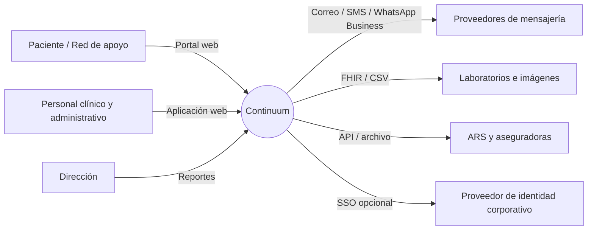
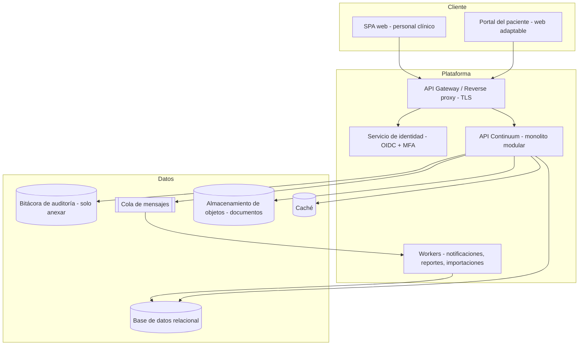

# 04 — Arquitectura general

## 1. Principios

1. **Monolito modular primero.** Un solo despliegue organizado en módulos con fronteras claras (los mismos de esta documentación). Es más simple de operar para el MVP y permite extraer servicios después si la carga lo justifica.
2. **Configuración sobre código.** Especialidades, procedimientos, plantillas, formularios y umbrales se definen como datos (módulo 11), no como pantallas programadas.
3. **Seguridad por diseño.** Autorización en el backend para cada solicitud; cifrado en tránsito y en reposo; auditoría en una capa transversal.
4. **API primero.** Todo lo que hace la interfaz se hace por una API documentada (OpenAPI), lo que habilita integraciones e incluso una app móvil futura.
5. **Multi-tenant desde el modelo.** Toda entidad de negocio lleva `organizacion_id` aunque el MVP opere con una sola organización (módulo 06).

## 2. Vista de contexto



## 3. Vista de contenedores



## 4. Módulos internos del backend

Cada módulo de negocio expone una interfaz interna y solo accede a sus propias tablas; la comunicación entre módulos se hace por llamadas a esa interfaz o por **eventos de dominio**.

| Módulo backend | Documento | Eventos que publica (ejemplos) |
|---|---|---|
| Organización | 06 | `SedeCreada` |
| Identidad y acceso | 03, 07 | `UsuarioDesactivado`, `RolAsignado` |
| Pacientes | 08 | `PacienteRegistrado`, `PacienteFusionado` |
| Catálogo | 11 | `ProcedimientoPublicado`, `FormularioPublicado` |
| Agenda y citas | 09, 10 | `CitaProgramada`, `CitaCancelada`, `InasistenciaRegistrada` |
| Historia clínica | 12, 13 | `NotaFirmada`, `OrdenEmitida` |
| Formularios | 14, 15 | `FormularioCompletado`, `UmbralDeRiesgoSuperado` |
| Comunicación | 17, 18 | `MensajeEnviado`, `NotificacionEntregada` |
| Reportes | 21 | — (consume eventos) |
| Auditoría | 23 | — (consume todos) |

## 5. Pila tecnológica de referencia (propuesta, a confirmar por ADR)

La asignatura combina tecnologías open source y propietarias; esta propuesta lo refleja. El equipo debe confirmar cada decisión con un ADR (plantilla en [`plantillas/plantilla-adr.md`](../plantillas/plantilla-adr.md)).

| Capa | Opción propuesta | Alternativa | Tipo |
|---|---|---|---|
| Frontend | React + TypeScript (Vite), librería de componentes accesible | Angular | Open source |
| Backend | ASP.NET Core (C#) Web API, arquitectura limpia por módulo | NestJS (Node.js) | Open source (ecosistema Microsoft) |
| Base de datos | PostgreSQL | SQL Server | Open source / Propietaria |
| Identidad | Keycloak (OIDC, MFA, SSO) | ASP.NET Core Identity + TOTP / Microsoft Entra ID | Open source / Propietaria |
| Caché | Redis | — | Open source |
| Cola de mensajes | RabbitMQ | Azure Service Bus | Open source / Propietaria |
| Almacenamiento de documentos | MinIO (compatible S3) | Azure Blob Storage | Open source / Propietaria |
| Reportes PDF | QuestPDF | — | Open source |
| Correo / SMS | SMTP transaccional + proveedor SMS | Twilio, SendGrid | Propietaria |
| Contenedores | Docker + Docker Compose (dev) | Kubernetes (producción a escala) | Open source |
| CI/CD | GitHub Actions | Azure DevOps | Propietaria |
| Observabilidad | OpenTelemetry + Grafana | Application Insights | Open source / Propietaria |

## 6. Decisiones de arquitectura y diseño

| ADR | Decisión | Estado |
|---|---|---|
| ADR-001 | Monolito modular frente a microservicios | Propuesta: monolito modular |
| [ADR-002](../adr/ADR-002-lenguaje-y-framework-backend.md) | Lenguaje y framework del backend | **Aceptada**: ASP.NET Core |
| [ADR-003](../adr/ADR-003-motor-de-base-de-datos.md) | Motor de base de datos | **Aceptada**: PostgreSQL |
| ADR-004 | Estrategia multi-tenant (columna `organizacion_id` frente a esquema por organización) | Propuesta: columna + políticas RLS |
| [ADR-005](../adr/ADR-005-proveedor-de-identidad.md) | Proveedor de identidad | **Aceptada**: identidad propia |
| ADR-006 | Plantillas clínicas: esquema JSON versionado frente a tablas EAV | Propuesta: JSON Schema versionado |
| ADR-007 | Proveedor de nube y región de alojamiento (residencia de datos) | Pendiente |
| [ADR-008](../adr/ADR-008-paleta-de-colores.md) | Paleta de colores del sistema de diseño | **Aceptada**: "Bosque y salvia" (módulo 28) |

## 7. Estructura sugerida del repositorio

```
continuum/
├── docs/                    ← esta documentación
├── src/
│   ├── Continuum.Api/       ← host, controladores, middleware (auth, auditoría, tenant)
│   ├── Modules/
│   │   ├── Organizacion/
│   │   ├── Identidad/
│   │   ├── Pacientes/
│   │   ├── Catalogo/
│   │   ├── Agenda/
│   │   ├── HistoriaClinica/
│   │   ├── Formularios/
│   │   ├── Comunicacion/
│   │   ├── Reportes/
│   │   └── Auditoria/
│   ├── Shared/              ← tipos comunes, eventos, resultado, errores
│   └── Workers/
├── web/                     ← SPA personal clínico + portal paciente
├── tests/
└── deploy/                  ← docker-compose, IaC
```

## Historial de cambios

| Versión | Fecha | Autor | Cambio | Solicitud |
|---|---|---|---|---|
| 1.0.0 | 2026-10-02 | Equipo | Versión inicial | — |
