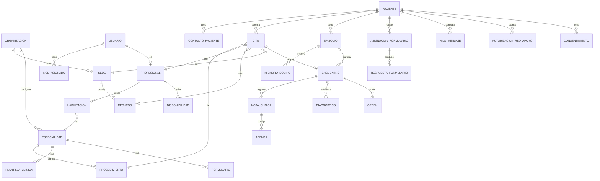

# 05 — Modelo de datos

## 1. Convenciones

- Toda entidad de negocio incluye: `id` (UUID), `organizacion_id`, `creado_en`, `creado_por`, `actualizado_en`, `actualizado_por`, `version` (concurrencia optimista).
- **No hay borrado físico** de entidades clínicas ni de catálogo; se usa `estado` (`activo`, `inactivo`, `anulado`) y fechas de vigencia (RN-006, RN-011).
- Fechas y horas en UTC; la zona horaria de presentación es la de la sede (por defecto `America/Santo_Domingo`).
- Los campos de categorías sensibles y datos de identificación se cifran a nivel de columna (módulo 24).
- Nombres de tablas en `snake_case` y singular.

## 2. Diagrama entidad-relación (núcleo)

## 3. Entidades principales

### 3.1 Organización y catálogo

| Entidad | Campos clave | Notas |
|---|---|---|
| `organizacion` | nombre, rnc, zona_horaria, configuracion (JSON) | Tenant (módulo 06) |
| `sede` | nombre, direccion, telefono, horario_atencion | |
| `especialidad` | codigo, nombre, descripcion, categoria_sensible (bool), estado | Módulo 11 |
| `procedimiento` | codigo_interno, codigo_externo, sistema_codificacion, nombre, especialidad_id, tipo, duracion_min, preparacion_min, limpieza_min, modalidad[], requiere_recurso_tipo, requisitos_previos (JSON), plantilla_nota_id, precio_referencia, version, vigente_desde, vigente_hasta, estado | Módulo 11 |
| `recurso` | sede_id, tipo, nombre, capacidad, estado | Consultorio, equipo, sala |
| `plantilla_clinica` | especialidad_id, nombre, esquema (JSON Schema), version, estado | Módulo 12 |
| `formulario` | codigo, nombre, esquema (JSON), reglas_puntuacion (JSON), umbrales (JSON), version, estado | Módulo 14 |

### 3.2 Personas y acceso

| Entidad | Campos clave | Notas |
|---|---|---|
| `usuario` | correo, telefono, estado, mfa_habilitado, ultimo_acceso | Credenciales en el servicio de identidad |
| `rol_asignado` | usuario_id, rol, sede_id | |
| `profesional` | usuario_id, nombres, apellidos, tipo_profesional, licencia, exequatur | |
| `habilitacion` | profesional_id, especialidad_id, procedimientos_permitidos[], vigente_hasta | RN-012 |
| `paciente` | numero_expediente, nombres, apellidos, tipo_documento, numero_documento (cifrado), fecha_nacimiento, sexo, telefono, correo, direccion, ars, numero_afiliado, estado | Módulo 08 |
| `contacto_paciente` | paciente_id, tipo (emergencia, tutor, red_apoyo), nombre, parentesco, telefono | |

### 3.3 Agenda

| Entidad | Campos clave | Notas |
|---|---|---|
| `disponibilidad` | profesional_id, sede_id, dia_semana, hora_inicio, hora_fin, procedimientos_permitidos[], vigente_desde, vigente_hasta | Módulo 09 |
| `bloqueo_agenda` | profesional_id / recurso_id, inicio, fin, motivo | |
| `cita` | paciente_id, profesional_id, procedimiento_id, recurso_id, sede_id, inicio, fin, modalidad, estado, origen, motivo_cancelacion, cancelada_en | Estados en módulo 10 |
| `lista_espera` | paciente_id, procedimiento_id, profesional_id (opcional), prioridad, rango_preferido, estado | RN-019 |

### 3.4 Historia clínica

| Entidad | Campos clave | Notas |
|---|---|---|
| `episodio` | paciente_id, especialidad_id, tratante_id, titulo, estado, categoria_sensible | |
| `miembro_equipo` | episodio_id, profesional_id, desde, hasta | |
| `encuentro` | episodio_id, cita_id, profesional_id, inicio, fin, modalidad | |
| `nota_clinica` | encuentro_id, plantilla_id, plantilla_version, contenido (JSON cifrado), estado (borrador/firmada), firmada_por, firmada_en, hash | Inmutable al firmar |
| `adenda` | nota_id, contenido, motivo, autor_id | RN-006 |
| `diagnostico` | encuentro_id, codigo_cie, descripcion, tipo (principal/secundario), estado | |
| `orden` | encuentro_id, tipo, detalle (JSON), estado, emitida_por | Módulo 13 |
| `antecedente` | paciente_id, tipo (alergia, quirúrgico, familiar…), descripcion | |
| `documento` | paciente_id, encuentro_id, tipo, ruta_objeto, hash, tamano | |

### 3.5 Seguimiento y comunicación

| Entidad | Campos clave |
|---|---|
| `asignacion_formulario` | paciente_id, formulario_id, version, asignado_por, frecuencia, inicio, fin |
| `respuesta_formulario` | asignacion_id, respuestas (JSON), puntuacion, nivel_riesgo, completado_en |
| `hilo_mensaje` / `mensaje` | paciente_id, profesional_id, contenido (cifrado), leido_en |
| `notificacion` | destinatario, canal, plantilla, estado, intentos |
| `autorizacion_red_apoyo` | paciente_id, contacto_id, alcance[], vigente_hasta, revocada_en |
| `consentimiento` | paciente_id, tipo, version_texto, firmado_por, firmado_en, evidencia |

### 3.6 Auditoría

| Entidad | Campos clave |
|---|---|
| `evento_auditoria` | ocurrido_en, usuario_id, rol, organizacion_id, accion, recurso, recurso_id, paciente_id, ip, agente, resultado, nivel, hash_anterior, hash |

## 4. Diccionario de estados

| Entidad | Estados |
|---|---|
| Cita | `solicitada` → `programada` → `confirmada` → `en_sala` → `en_atencion` → `completada` · `cancelada` · `inasistencia` · `reprogramada` |
| Nota clínica | `borrador` → `firmada` (→ adendas) |
| Orden | `borrador` → `emitida` → `en_proceso` → `completada` · `anulada` |
| Procedimiento / formulario / plantilla | `borrador` → `publicado` → `inactivo` |
| Episodio | `abierto` → `cerrado` |

## 5. Retención

| Dato | Retención mínima | Referencia |
|---|---|---|
| Historia clínica | Según normativa sanitaria vigente; por defecto **15 años** desde el último encuentro (a validar con asesoría legal) | Módulo 24 |
| Bitácora de auditoría | 10 años | RNF09 |
| Mensajes | Igual que la historia clínica | RN-008 |
| Notificaciones enviadas | 2 años | — |

## Historial de cambios

| Versión | Fecha | Autor | Cambio | Solicitud |
|---|---|---|---|---|
| 1.0.0 | 2026-10-02 | Equipo | Versión inicial | — |
