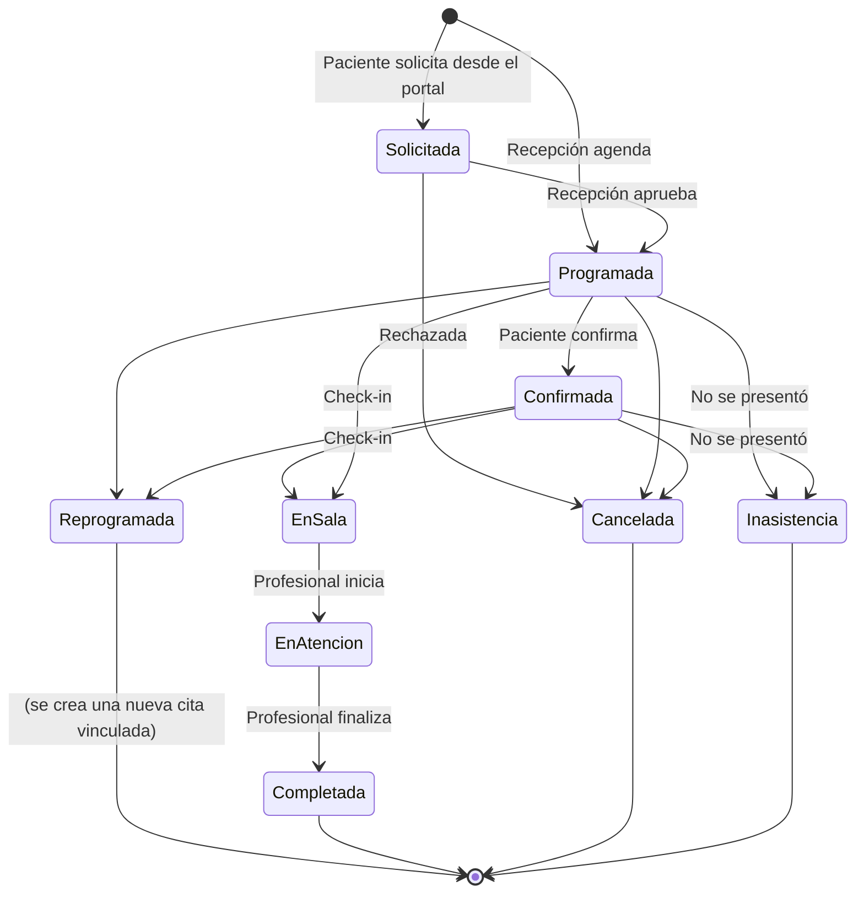

# 10 — Gestión de citas

## 1. Objetivo

Programar, confirmar, reprogramar, cancelar y dar seguimiento a las citas de todas las especialidades, respetando la disponibilidad, los requisitos de cada procedimiento y las políticas de la organización.

## 2. Ciclo de vida

## 3. Requisitos funcionales

| ID | Requisito | Prioridad | Origen |
|---|---|---|---|
| RF-CIT-001 | El sistema deberá permitir a recepción programar una cita seleccionando paciente, especialidad, procedimiento, profesional (o "el primero disponible"), sede, modalidad y espacio libre. | M | RF02 |
| RF-CIT-002 | El sistema deberá impedir agendar a un paciente con registro incompleto (RN-003). | M | RN03 |
| RF-CIT-003 | El sistema deberá impedir citas solapadas para el profesional, el recurso y el paciente, y citas fuera de la disponibilidad definida (RN-004). La validación se hará en el servidor con bloqueo transaccional. | M | RN04 |
| RF-CIT-004 | El sistema deberá permitir reprogramar una cita manteniendo el vínculo con la original y el motivo. | M | RF02 |
| RF-CIT-005 | El sistema deberá permitir cancelar una cita con motivo; si la cancelación ocurre con menos anticipación que el plazo configurado (24 h por defecto, ajustable por procedimiento), se registrará como inasistencia (RN-005). | M | RN05 |
| RF-CIT-006 | El sistema deberá permitir al paciente consultar sus citas próximas y anteriores desde el portal. | M | RF02 |
| RF-CIT-007 | El sistema deberá permitir al paciente solicitar, confirmar y cancelar citas desde el portal, para los procedimientos que la organización marque como autoagendables. | S | RF02 |
| RF-CIT-008 | El sistema deberá mostrar al agendar los requisitos previos del procedimiento (ayuno, orden médica, consentimiento, estudios previos) y enviarlos al paciente en la confirmación (RN-014). | M | GEN |
| RF-CIT-009 | El sistema deberá validar que el profesional esté habilitado para el procedimiento (RN-012). | M | GEN |
| RF-CIT-010 | El sistema deberá permitir el check-in en recepción, registrando la hora de llegada y moviendo la cita a "en sala". | M | GEN |
| RF-CIT-011 | El sistema deberá marcar automáticamente como inasistencia las citas sin check-in 30 minutos (configurable) después de su hora de inicio, previa confirmación de recepción al cierre del día. | S | RN05 |
| RF-CIT-012 | El sistema deberá gestionar una lista de espera por procedimiento y profesional; al liberarse un espacio, ofrecerlo según RN-019. | S | GEN |
| RF-CIT-013 | El sistema deberá permitir citas recurrentes (p. ej., 10 sesiones semanales de fisioterapia o psicoterapia) validando cada ocurrencia y reportando las que no tengan espacio. | S | GEN |
| RF-CIT-014 | El sistema deberá permitir registrar la modalidad: presencial, telefónica o virtual (con enlace externo en Fase 2). | M | GEN |
| RF-CIT-015 | El sistema deberá alertar al agendar si el paciente alcanzó el límite de inasistencias (RN-020). | S | GEN |
| RF-CIT-016 | El sistema deberá permitir registrar el número de autorización de la ARS en la cita cuando el procedimiento lo requiera. | C (Fase 3) | EXT |

## 4. Criterios de aceptación

| ID | Dado / Cuando / Entonces |
|---|---|
| CA-CIT-001 | **Dado** que dos recepcionistas intentan reservar el mismo espacio al mismo tiempo, **cuando** ambos guardan, **entonces** solo una cita se crea y el otro usuario recibe "El espacio ya no está disponible" con alternativas. |
| CA-CIT-002 | **Dado** una cita el martes a las 10:00 y un plazo de 24 h, **cuando** el paciente cancela el lunes a las 15:00, **entonces** la cita queda como "inasistencia" con motivo "cancelación tardía". |
| CA-CIT-003 | **Dado** un procedimiento "Colonoscopia" con requisito "ayuno de 8 horas", **cuando** se agenda, **entonces** la confirmación al paciente incluye la instrucción de preparación. |
| CA-CIT-004 | **Dado** un psicólogo, **cuando** recepción intenta asignarle "Consulta de psiquiatría", **entonces** el sistema no lo ofrece porque no está habilitado. |
| CA-CIT-005 | **Dado** un paciente con 3 inasistencias en 90 días, **cuando** se le agenda una nueva cita, **entonces** recepción ve una alerta y debe confirmarla. |

## 5. Pantallas

- Citas › Agendar (asistente: paciente → procedimiento → profesional/espacio → confirmación).
- Citas › Agenda del día de la sede (tablero por estado: programadas, en sala, en atención, completadas).
- Citas › Lista de espera.
- Portal › Mis citas.

## Historial de cambios

| Versión | Fecha | Autor | Cambio | Solicitud |
|---|---|---|---|---|
| 1.0.0 | 2026-10-02 | Equipo | Versión inicial | — |
